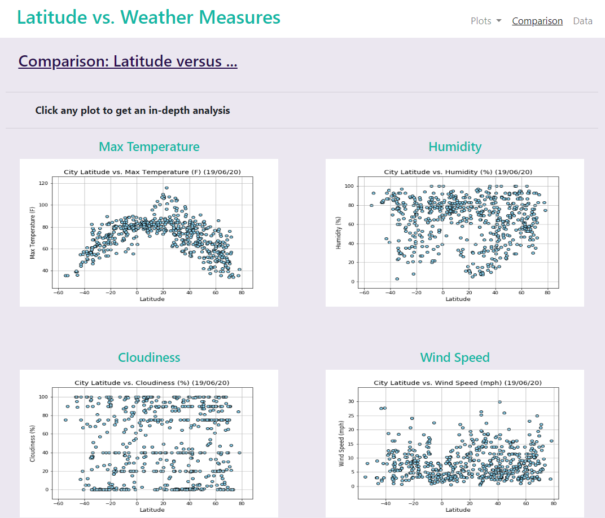

# Weather vs. Latitude - Data Visualization Dashboard 

### See deployed Github Page > https://mcglash.github.io/Web-Design-Challenge

## Latitude - Latitude Analysis Dashboard with Attitude

I created website using visualizations created in a [past project](https://github.com/McGlash/api-challenge).

In building this dashboard, I created individual pages for each plot and a means by which to navigate between them. These pages contain the visualizations and their corresponding explanations, and a landing page where the viewer can see a comparison of all of the plots, and another page where they can view the data used to build them.

### Website 

For reference, see the ["Screenshots" section](#screenshots) below.

The website consists of 7 pages total, including:

* A [landing page](#landing-page) containing:
  * Links to each visualizations page. There is a sidebar containing preview images of each plot, and clicking an image should take the user to that visualization.
* Four [visualization pages](#visualization-pages), each with:
  * The plot/visualization itself for the selected comparison.
* A ["Comparisons" page](#comparisons-page) that:
  * Contains all of the visualizations on the same page so we can easily visually compare them.
  * Uses a Bootstrap grid for the visualizations.
* A ["Data" page](#data-page) that:
  * Displays a responsive table containing the data used in the visualizations.

The website has a navigation menu that:

* Has the name of the site on the left of the nav which allows users to return to the landing page from any page.
* Contains a dropdown menu on the right of the navbar named "Plots" that provides a link to each individual visualization page.
* Provides two more text links on the right: "Comparisons," which links to the comparisons page, and "Data," which links to the data page.
* Is responsive (using media queries) ["Navigation Menu" section](#navigation-menu).

### Screenshots

This section contains screenshots of each page that was built, at varying screen widths. 

#### Landing page

Large screen:

Small screen:



#### Comparisons page

Large screen:

Small screen:

#### Data page

Large screen:

Small screen:

#### Visualization pages

You'll build four of these, one for each visualization. Here's an example of one:

Large screen:

Small screen:

#### Navigation menu

Large screen:

Small screen:

